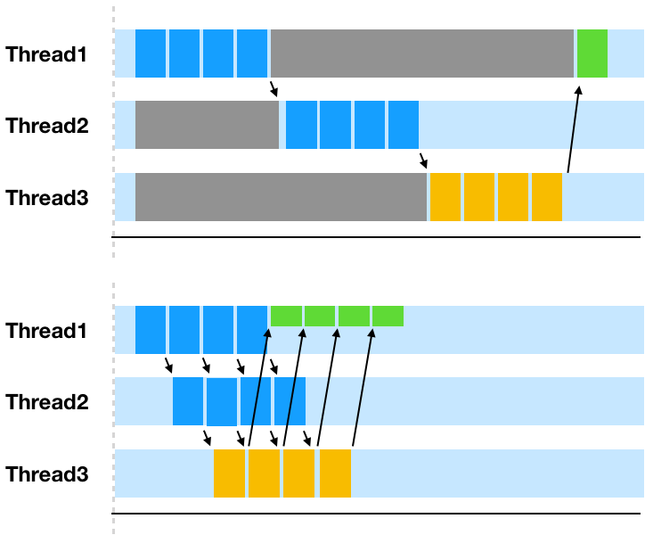
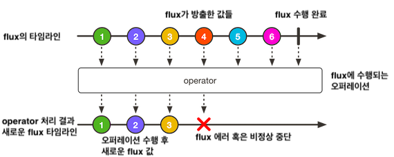

# 10장 리액터 개요

### 명령형 코드와 리액티브 코드의 차이

- 명령형 코드
    - 순차적으로 연속되는 작업
    - 작업은 한번에 하나씩, 그리고 이전 작업 다음에 실행된다
    - 데이터는 모아서 처리되며, 이전 작업이 데이터 처리를 끝낸 후에 다음 작업으로 넘어감
- 리액티브 코드
    - 정의된 일련의 작업들이 병행으로 처리됨
    - 각 작업은 부분 집합의 데이터를 처리
    - 처리가 끝난 부분집합을 다음 작업에 넘기고 새로운 부분집합의 데이터로 작업
    - Spring에서는 Reactor를 사용하여 리액티브 프로그램을 개발 할 수 있다.


### 명령형 프로그래밍의 한계와 리액티브 프로그램



- 명령형의 한계
    - 하나의 작업이 실행되는 동안 스레드가 차단됨
        - 원격지의 데이터베이스를 가져오는 등의 시간이 오래 걸리는 작업이라면 차단된 스레드의 낭비가 크다
        - 데이터 전체가 로드되지 않으면 다음 작업으로 진행되지 않는다
    - 동시프로그래밍을 지원하며 스레드를 새롭게 만들어서 작업을 실행하기는 쉽지만, 다중 스레드로 동시성을 관리하기는 어려움
    - 물풍선에 비유할 수 있음
- 대안은 리액티브 프로그래밍
    - 본질적으로 함수적이며 선언적
    - 순차적으로 진행되는 작업단계를 나타낸 것이 아닌 데이터가 흘러가는 파이프라인이나 스트림을 포함
    - 데이터 전체가 로드될때까지 기다리지 않고 사용 가능한 데이터가 있을 때마다 처리되므로 사실상 무한한 데이터 입력가능
    - 정원 호스에 비유 할 수 있음

### 리액티브 스트림의 정의

- 차단되지 않는 백프레셔를 갖는 비동기 스트림 처리의 표준을 제공하는 것이 목적
- 비동기적 특성으로 동시에 여러 작업을 수행가능하며 더 큰 확장성을 얻을 수 있음
- 백프레셔** 를 통해 컨슈머가 처리할 수 있는 만큼의 데이터를 제공하여 데이터 전달 폭주를 피할 수 있음

### 자바 스트림과 리액티브 스트림

- 비슷한 점
    - 다수의 동일한 오퍼레이션 제공 filter, map 등등
- 다른점
    - 자바 스트림은 동기화 되어있으며 한정된 데이터로 작업을 수행
    - 리액티브 스트림은 어떤 사이즈의 데이터셋이라도 비동기 처리를 지원 및 백프레셔 사용으로 데이터 폭주를 제한

### 리액티브 스트림의 기본 구성요소

- 리액티브 스트림은 4가지의 기본 구성요소 (Publisher, Subscriber, Subscription, Process)로 이루어져 있다
- Publisher

    ```java
    public interface Publisher<T> {
        public void subscribe(Subscriber<? super T> s);
    }
    ```

    - publisher 는 subscription당 하나의 subscribe에 발행하는 데이터를 생성
    - subscriber 가 구독 신청되면 publisher로부터 이벤트를 수신 할 수 있다.
    - 전송된 데이터는 Subscriber의 메서드를 통해 호출됨
- Subscriber

    ```java
    public interface Subscriber<T> {
        public void onSubscribe(Subscription s);
        public void onNext(T t);
        public void onError(Throwable t);
        public void onComplete();
    }
    ```

    - subscriber subscription을 통해 구독을 관리한다
- Subscription

    ```java
    public interface Subscription {
        public void request(long n);
        public void cancel();
    }
    ```

    - request를 호출하여 전송되는 데이터를 요청
    - cancel을 호출하여 구독취소
    - request를 호출할때 받는 데이터 항목 수를 나타내는 long 타입인자가 backpressure이며, 이로 인해 subscriber가 처리할 수 있는 양보다 많은 데이터가 전송되는것을 막아준다.
    - Publisher에서 더이상 전송할 데이터가 없고, 더이상의 데이터를 생성하지 않는다면 publisher가 onComplete()를 호출하여 작업이 끝났다고 알려준다.
- Processor

    ```java
    public interface Processor<T, R> extends Subscriber<T>, Publisher<R> {
    }
    ```

    - subscriber와 publisher를 결합한 인터페이스
    - 실제사용 예제?**

### 리액터 시작하기

- Mono 와 Flux
    - Mono와 Flux 모두 Publisher 인터페이스의 구현체.
    - Mono
        - 0-1개의 데이터셋을 갖는 리액티브 타입
    - Flux
        - 0~N(무한)개의 데이터셋을 갖는 리액티브 타입 (파이프라인)
    - 왜 Mono를 사용하는걸까?
        - 어떤 시스템에서는 Multi Results가 아닌 하나의 데이터셋만 있는 경우가 있다.
        - 하나의 결과가 있을때 Collection을 사용하여 리턴하지 않는 것과 같은 맥락
        - [https://stackoverflow.com/questions/48172095/why-is-the-mono-type-needed-in-reactor-3](https://stackoverflow.com/questions/48172095/why-is-the-mono-type-needed-in-reactor-3)
- 리액티브 플로우는 마블 다이어그램으로 나타내는게 보편적이다 (라이브러리 주석에도 그림으로 표현됨!)


- Flux와 Mono에는 약 500개의 operation이 존재함
    - creation operation
    - combination operation
    - transformation operation
    - logic operation

### 리액터 생성

- 객체로부터 생성

    ```java
    Flux<String> flux = Flux.just("Apple", "Orange")
    ```

    - 데이터의 전달을 위해서는 subscriber가 필요함

    ```java
    fruitFlux.subscribe(
                    f -> System.out.println("Here's some fruit:" + f)
            );
    ```

    - subscribe에 지정된 람다는 java.util.Consumer이며 Subscriber객체를 생성하기 위해 사용됨
    - operation이 없기때문에 바로 subscribe에 의해 호출됨
- 컬렉션으로 부터 생성하기 (여기부터 쭉 FluxTest.java에서 설명)
    - 배열, Iterable, Stream객체로부터 생성됨
    - StepVerifier를 사용하여 Flux 데이터를 검사한다
- Flux 데이터 생성
    - range() : 증가값
    - interval() : 시간이나 주기

### 리액터 조합

- merge()
    - 양쪽 플러스에서 완벽히 번갈아가면서 방출됨을 보장할 수 없다
- zip()
    - 여러 flux에서 번갈아가며 방출된 데이터의 n가지 셋
- zip to object
- ~~first()~~ deprecated → firstWithSignal()
    - 먼저 방출되는 flux만 데이터 전송

### 리액티브 스트림 변환과 필터링

- skip()
    - 필요한 만큼 스킵한 후 부터 데이터 전송
- take()
    - 처음 지정된 수(또는 기간)의 항목만 방출
- filter()
    - 범용적인 필터링을 위한 오퍼레이션
    - java 스트림의 필터와 동일하게 작동함
- distinct()
    - 중복제거
- map()
    - 전달된 데이터를 다른 객체나 타입으로 매핑할때 사용
    - 단점은 발행시 동기적으로 매핑이 수행됨
        - 리액터의 이점을 살리지 못한다
- flatMap()
    - map과 다르게 비동기적으로 매핑을 수행할 수 있음.
    - 비동기적으로 수행되기때문에 처리의 순서를 보장받을 수 없다.
    - subscribeOn()의 호출을 통해 비동기적 매핑을 수행할 수 있게된다.
        - 사용할 수 있는 Schedulers의 동시성 모델에는 5가지가 있음
            - . immediate()
            - .single()
            - .newSinge()
            - .elastic()
            - .parallel()
- buffer()
- collectionList()
- collectionMap()
