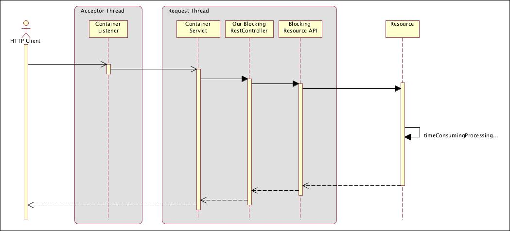
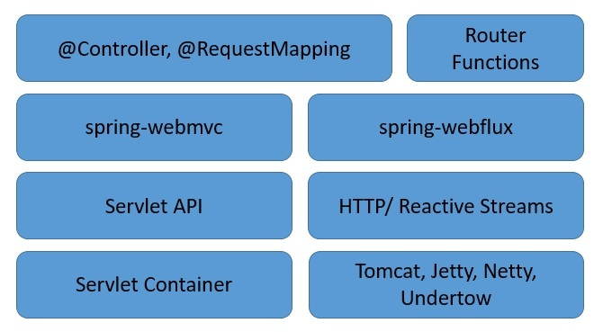
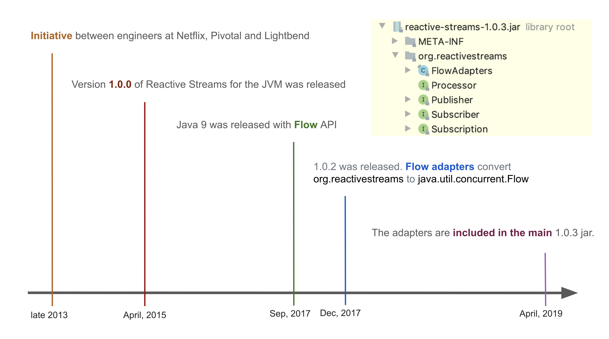
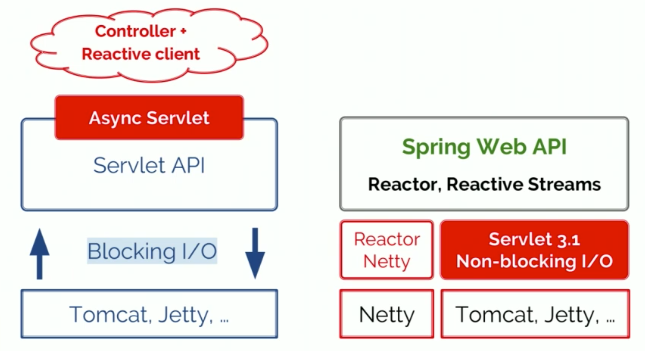
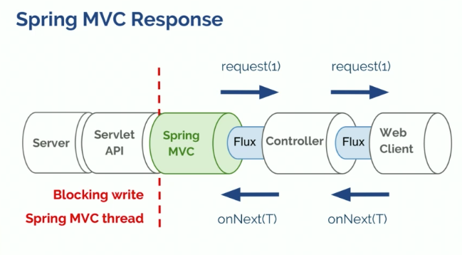
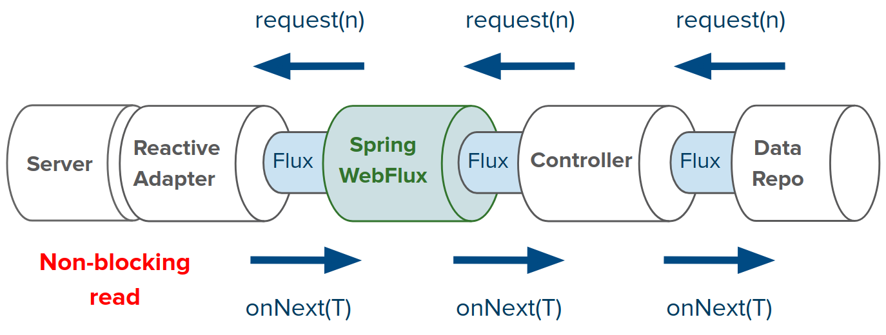

# 11. 리액티브 API 개발하기

책에서 다루는 내용

- 스프링 WebFlux 사용하기
- 리액티브 컨트롤러와 클라이언트 작성하고 테스트하기
- REST API 소비하기
- 리액티브 웹 어플리케이션의 보안

흠.. 역시 이번 장에서 다룰 주된 내용은.. → "**스프링 WebFlux**"

들어가기 전에..

**Spring WebFlux가 무엇이냐**

- Spring WebFlux는 리액티브 스택 웹 프레임워크
(Spring Web MVC를 포함한 기존의 웹 프레임워크는 서블릿 API와 서블릿 컨테이너를 위해 개발됨)
- 완전한 Non-Blocking
- 리액티브 스트림 Back Pressure를 지원
- Netty, Undertow, 서블릿 3.1+ 컨테이너 서버에서 실행됨

**왜 만들어졌나?**

제일 큰 두 가지 이유

1. "Non-Blocking 웹 스택이 필요해!"

    적은 수의 스레드, 그리고 보다 적은 하드웨어 리소스로 동시성을 처리하기 위함

    사실, 서블릿 3.1에서도 이미 Non-Blocking I/O를 위한 API를 제공
    하지만, 이 서블릿으로 Non-Blocking을 구현하려면, 
    Filter, Servlet과 같은 동기 처리 방식이나 getParameter, getPart등의 Blocking 방식을 쓰는 API를 사용하기가 어려움

2. "함수형 프로그래밍!"

    자바 8의 '람다 표현식' → 덕분에 자바에서도 함수형 API를 작성할 수 있음

    → Non-Blocking 어플리케이션을 만들 때 유용

    continuation-style API로 비동기 로직을 선언적으로 작성할 수 있음

    Annotated-Controller와 함께 Functional Endpoints를 사용할 수 있게 됨

### **리액터**

- Spring WebFlux가 채택한 "리액티브 라이브러리"

**리액티브 스트림?**

- 자바 9에서 채택된 스펙
- Back-Pressure를 통해서 비동기 컴포넌트들 사이의 상호작용을 정의한 간단한 스펙
- 주 목적? subscriber가 publisher의 데이터 생산 속도를 제어하는 것
    - 예를 들면

        데이터 저장소는 서버에게 데이터를 제공

        데이터를 제공하는 쪽을 Publisher, 제공받는 쪽을 Subscriber라고 하면..

        Subscriber가 Publisher로부터 받는 데이터의 속도를 제어할 수 있게 함

        (Publisher가 속도를 늦출 수 없으면..? buffer/drop/fail.. 결정을 해야지..)

웹 어플리케이션에서 비동기 로직을 작성 or 사용하기에는 좀 low-level

어플리케이션 API로는 적합하지가 않아..

좀 더 고수준의.. 더 풍부한 함수형 API가 필요해..!

→ 그래서 "리액티브 라이브러리"

리액터가 core 라이브러리지만, 다른 리액티브 라이브러리와도 상호 운용 가능 (ex : RxJava)

[https://docs.spring.io/spring-framework/docs/current/reference/html/web-reactive.html#webflux-reactive-libraries](https://docs.spring.io/spring-framework/docs/current/reference/html/web-reactive.html#webflux-reactive-libraries)

### 프로그래밍 모델

Spring WebFlux는 두 가지 프로그래밍 모델을 지원함

1. Annotated-Controller
2. Functional Endpoints

**Annotated-Controller**

spring-web 모듈에 있는 같은 어노테이션을 사용

Spring MVC와 Webflux 컨트롤러 모두 Reactive Return Type을 지원 → 구분하기 어려운데..?

차이점 : WebFlux에서는 @RequestBody로 리액티브 인자를 받을 수 있음

**Functional Endpoints**

람다 기반의 경량 함수형 프로그래밍 모델

요청을 라우팅해주는 유틸리티의 집합? 또는 소형 라이브러리? 로 생각하면 되려나

**Annotated-Controller VS Functional Endpoints**

Annotated-Controller : 어노테이션으로 의도를 표현하고, 콜백을 받아 처리함

Functional Endpoints : 어플리케이션이 요청 핸들링을 시작부터 끝까지 책임짐

**장단점**

이런 맛에 Functional Endpoints 쓰지!

모든 웹 요청 처리 작업을 명시적인 코드로 작성

메소드 시그니처 관례, 타입 체크 불가능한 어노테이션에 의존하는 @MVC 스타일보다 명확함

정확한 타입 체크 가능

함수 조합을 통한 편리한 구성, 추상화에 유리

테스트 작성이 편리함

핸들러 로직도, 요청 매핑도, 리턴 값 처리까지 단위테스트로 작성 가능

이런 맛에 Annotated-Controller 쓰지!

po익숙wer

함수형 스타일의 코드 작성이 편하지 않은 경우

- 스프링 MVC의 어노테이션 기반 프로그래밍 모델의 **단점**

    어노테이션이 '무엇을 하는지'와 '어떻게해야 하는지'를 정의하는데 괴리가 있음

    어노테이션 자체는 '무엇'을 정의하고, '어떻게'는 코드 어딘가 정의되어 있음

    → 커스텀하려면 어노테이션 외부에 있는 코드로 작업해야 함
    (어노테이션에 breakpoint를 설정할 수 없기 때문에 디버깅이 까다로움)

    → 스프링 5에서는 리액티브 API를 정의하기 위한 새로운 **함수형 프로그래밍 모델**이 소개됨

### 서버

Spring WebFlux는 Tomcat, Jetty, Servlet 3.1+ 컨테이너에서도, 그리고 서블릿 기반이 아닌 Netty, Undertow에서도 잘 동작함

low-level의 공통 API로 서버를 추상화하기 때문에 모든 서버에서 고수준의 프로그래밍 모델을 적용할 수 있음

**Netty**

스프링 부트는 WebFlux 스타터 의존성에 Netty를 기본으로 설정함

왜 하필 Netty.. Netty는 비동기, Non-Blocking 영역에서 폭넓게 사용되고 클라이언트와 서버가 자원을 공유하도록 하기 때문

**Undertow**

Spring WebFlux는 서블릿 API가 아닌 Undertow API를 직접 사용함

**Tomcat/Jetty**

Tomcat과 Jetty는 Spring MVC, WebFlux 모두에서 사용할 수 있지만 동작하는 방식이 다름

Spring MVC → 서블릿의 blocking I/O 사용

Spring WebFlux → 서블릿 3.1의 Non-Blocking I/O로 동작

# 스프링 WebFlux 사용하기

Spring Web MVC의 Thread Blocking



매 연결마다 하나의 스레드를 사용하는 스프링 MVC같은 전형적인 서블릿 기반의 웹 프레임워크는 Thread Blocking과 Multi-Thread로 수행됨
(요청을 처리하는 동안 blocking에 대비하기 위해 서블릿 컨테이너가 애초에 큰 스레드 풀을 사용)

즉, Request가 처리될 때 Thread Pool에서 스레드를 가져와서 해당 Request 처리

그리고, 작업 스레드가 종료될 때까지 Request 스레드는 Blocking

그래서 발생하는 문제점

- Request의 증가에 따라 확장이 어려움
- 처리가 느린 작업 스레드로 인해 훨씬 더 심각한 상황이 발생함
(해당 작업 스레드가 풀로 반환되어 또다른 요청 처리를 준비하는데 오랜 시간이 걸리기 때문)

**비동기 웹프레임워크**


이벤트 루프는 비용이 드는 작업이 필요할 때 해당 작업의 callback을 등록하여 병행으로 수행하고 다른 이벤트 처리로 넘김
     (데이터베이스나 네트워크 작업 등등)

작업이 완료될 때도 이벤트로 처리

**결론**

- 소수의 스레드로도 비교적 많은 요청을 처리

### Spring WebFlux

**Spring MVC와 Spring WebFlux의 Stack**



스프링 MVC는 실행 시에 서블릿 컨테이너가 필요한 자바 서블릿 API의 상위 계층에 위치
                                           (Like 톰캣)

스프링 WebFlux는 서블릿 API와 연계되지 않음

→ 서블릿 API에서 제공하는 것과 동일한 기능의 리액티브 버전인 리액티브 HTTP API의 상위 계층에 위치

→ 서블릿 API에 연결되지 않으므로 실행하기 위해 서블릿 컨테이너를 필요로 하지 않음
     대신 Blocking이 없는 웹 컨테이너에서도 실행될 수 있음
(Netty, Undertow, Tomcat, Jetty 기타 Servlet 3.1 이상의 컨테이너)

공통 컴포넌트들이 있음

- Spring MVC와 Spring WebFlux 간 같은 어노테이션을 공유하기도 함
(주로 컨트롤러를 정의하는 데 사용되는 어노테이션들)

Router Functions : 어노테이션 대신 함수형 프로그래밍 패러다임으로 컨트롤러를 정의하는 대안 프로그래밍 모델

**스프링 WebFlux 스타터 의존성**

```xml
<dependency>
    <groupId>org.springframework.boot</groupId>
    <artifactId>spring-boot-starter-**webflux**</artifactId>
</dependency>
```

- Spring MVC 대신 WebFlux를 사용할 때는 기본적인 내장 서버가 톰캣 대신 Netty가 됨
                                                                   (몇 안되는 비동기적 이벤트 중심의 서버, 리액티브 웹 프레임워크와 잘 맞음)

중요한 특징

- Spring WebFlux에서는 Mono나 Flux같은 **리액티브 타입**을 인자로 받거나 반환함 (도메인 타입이나 컬렉션 대신)
- Spring WebFlux 컨트롤러는 Observable, Single, Completable과 같은 RxJava 타입도 처리함
- RxJava VS Reactor

    RxJava?

    JVM을 위한 ReactiveX 라이브러리

    넷플릭스에서 오랜기간동안 리액티브 패턴을 사용함 → Netflix/RxJava를 오픈소스로 공개 (현재는 ReactiveX/RxJava)

    '*리액티브 세대 분류 체계*'에 따르면 리액티브 2세대 라이브러리
    ([https://akarnokd.blogspot.com/2016/03/operator-fusion-part-1.html](https://akarnokd.blogspot.com/2016/03/operator-fusion-part-1.html))

    Reactor?

    Spring의 오픈소스팀이 만든 java 프레임워크

    '*리액티브 세대 분류 체계*'에 따르면 리액티브 4세대 라이브러리

    Reactor VS RxJava

    - Reactive Streams

        표준 API

        리액티브 스트림즈 표준 : [http://www.reactive-streams.org/](http://www.reactive-streams.org/)

        

        2013 : 처음 개발되기 시작

        2015 April : jvm에서 사용하기 위한 1.0.0을 릴리즈

        2017 Sep : Reactive Streams의 api와, 스펙, pull 방식 사용 원칙을 그대로 포팅해서 java.util.concurrent 패키지에 Flow API를 추가시킨 java9이 릴리즈

        2017 Dec : reactivestreams와 Flow와 상호변환이 가능한 Flow Adapter를 릴리즈

    Reactor 3.0(with Java8 이상)에서 얻을 수 있는 혜택
    [https://hyoj.github.io/blog/java/spring/rxjava-vs-reactor/#david-karnok-on-twitter](https://hyoj.github.io/blog/java/spring/rxjava-vs-reactor/#david-karnok-on-twitter)

    RxJava2가 Reactive Streams 표준 이후에 개발되면서 Reactive Streams 인터페이스를 구현하기는 했지만, Reactive Streams 표준을 준수하지는 않음

*"리액티브 타입은 WebFlux에서만 사용할 수 있다?"* → Nope

스프링 WebFlux 컨트롤러가 Mono나 Flux같은 리액티브 타입을 반환할 수 있다고 해서, WebFlux에서만 리액티브 타입을 반환하는 것은 아님
스프링 MVC에서도 리액티브 타입을 사용할 수 있음

다만 차이는 있음!.. 바로 타입들이 사용되는 방법!







Spring WebFlux는 요청이 이벤트 루프로 처리되는 진정한 리액티브 웹 프레임워크
스프링 MVC는 Multi-Thread에 의존하여 다수의 요청을 처리하는 서브릿 기반 웹 프레임워크

### 리액티브 컨트롤러 작성

```java
@RestController
@RequestMapping(path = "/design", produces = "application/json")
@CrossOrigin(origins = "*")
@RequiredArgsConstructor
public class DesignTacoController {

    private final TacoRepository tacoRepository;

    @GetMapping("/recent")
    public Flux<Taco> recentTacos() {
        return tacoRepository.findAll().take(12);
    }

		@GetMapping("/{id}")
    public Mono<Taco> tacoById(@PathVariable("id") Long id) {
        return tacoRepository.findById(id);
    }

}
```

return type이 Flux/Mono인 걸 제외하고는 Spring MVC와 크게 다를 바가 없음

### RxJava 타입

리액티브 타입 말고도, RxJava 타입을 사용할 수도 있음
(Flux나 Mono)         (Observable이나 Single)

```java
@GetMapping("/recent")
public Observable<Taco> recentTacos() {
    return tacoService.getRecentTacos();
}

@GetMapping("/{id}")
public Single<Taco> tacoById(@PathVariable("id") Long id) {
    return tacoService.lookupTaco(id);
}
```

**입력도 리액티브하게!**

요청을 처리하는 핸들러 메소드에서도 Mono나 Flux 타입을 받을 수 있음

```java
@PostMapping(consumes = "application/json")
@ResponseStatus(HttpStatus.CREATED)
public **Mono**<Taco> postTaco(@RequestBody **Mono**<Taco> taco) {
    return tacoRepository.saveAll(taco).next();
}
```

핸들러 메소드를 위와 같이 수정함으로써, postTaco 진입할 때에도 blocking되지 않도록 처리할 수 있음

리액티브 타입을 지원하는 Method Arguments

- WebSession
- java.security.Principal
- @RequestBody
- HttpEntity<B>
- @RequestPart

end-to-end Reactive Stack

리액티브 웹 프레임워크의 장점을 극대화하려면 완전한 end-to-end Reactive Stack의 일부가 되어야 함

# ~~함수형 요청 핸들러 정의하기~~ Functional Endpoints

Spring WebFlux는 경량화된 함수형 프로그래밍 모델(WebFlux.fn)을 지원
(어노테이션을 사용하지 않고 요청을 핸들러 코드에 연관시킬 수 있음)

함수로 요청을 라우팅하고 핸들링하기 때문에 불변성(Immutablility)을 보장

함수형 모델과 어노테이션 모델 중 하나를 선택하면 되는데, 둘 다 Reactive Core 기반 위에서 작동

- **Reactive Core**

    spring-web 모듈은 다음과 같은 방법으로 리액티브 웹 어플리케이션을 만들 수 있음

    **서버 사이드**

    - low level, high level로 나눠서 처리 (두 가지 level로 지원)
    - **HttpHandler**

        Non-Blocking I/O와 Reactive Stream Back-Pressure로 HTTP요청 처리

        Reactor Netty, Undertow, Tomcat, Jetty, Servlet 3.1+ 컨테이너 어덥터와 함께 사용

    - **WebHandler API**

        요청 처리를 위한 조금 더 high level의 범용 웹 API

        Annoated-Controller나 Functional Endpoints같이 구체적 프로그래밍 모델로 작성

    - **HttpHandler vs WebHandler API**

        목표 관점..

        HttpHandler : 각기 다른 HTTP 서버를 쓰기 위한 추상화가 전부

        WebHandler API : 웹 어플리케이션에서 흔히 쓰는 광범위한 기능을 제공

        User Session & Session attributes

        Request attribute

        Locale, Principal Resolve

        form 데이터 파싱, 캐시 조회

        multipart 데이터 추상화

        : etc

    **클라이언트 사이드**

    - 기본적으로 *ClientHttpConnector*가 Non-Blocking I/O와 Reactive Stream Back-Pressure로 HTTP 요청을 처리
    (Reactor Netty, Reactive Jetty HttpClient 어덥터를 사용해 동작)
    - 고수준 WebClient는 이를 기반으로 동작

    클라이언트와 서버는 HTTP 요청과 응답 컨텐츠를 serialize/deserialize하기 위해 코덱을 사용함

    [https://www.notion.so/Reactive-Core-2496698856174f0a8272dd060e758b67](https://www.notion.so/Reactive-Core-2496698856174f0a8272dd060e758b67)

이하의 내용에서는 WebHandler API 방식만 다룸

### Overview

`HandlerFunction`

WebFlux.fn에선 `HandlerFunction`이 HTTP 요청을 처리
(`ServerRequest`를 받아 비동기 `ServerResponse`(i.e. `Mono<ServerResponse>`)를 리턴)

어노테이션 프로그래밍 모델로 치면 `@RequestMapping` 이 붙은 메소드가 하던 일과 동일

`RouterFunction`

요청을 `HandlerFunction`에 라우팅함 - `ServerRequest`를 받아 비동기 `HandlerFunction`(i.e. `Mono<HandlerFunction>`)을 리턴

매칭되는 `RouterFunction`이 있으면 `HandlerFunction`을 리턴, 그 외는 비어있는 Mono를 리턴

어노테이션 프로그래밍 모델로 치면 `@RequestMapping` 

```java
import static org.springframework.http.MediaType.APPLICATION_JSON;
import static org.springframework.web.reactive.function.server.RequestPredicates.*;
import static org.springframework.web.reactive.function.server.RouterFunctions.route;

PersonRepository repository = ...
PersonHandler handler = new PersonHandler(repository);

**RouterFunction<ServerResponse> route = route()
    .GET("/person/{id}", accept(APPLICATION_JSON), handler::getPerson)
    .GET("/person", accept(APPLICATION_JSON), handler::listPeople)
    .POST("/person", handler::createPerson)
    .build();**

public class PersonHandler {

    // ...

    public Mono<ServerResponse> listPeople(ServerRequest request) {
        // ...
    }

    public Mono<ServerResponse> createPerson(ServerRequest request) {
        // ...
    }

    public Mono<ServerResponse> getPerson(ServerRequest request) {
        // ...
    }
}
```

### HandlerFunction

요청, 응답 body 모두 리액티브 스트림 back pressure로 처리

request body는 리액터 `Flux`나 `Mono`로 표현 (사실 어떤 리액티브 스트림 `Publisher`든 상관없음 - 다른 리액티브 라이브러리를 써도 된다는 말 like RxJava)

**ServerRequest**

`ServerRequest`로 HTTP 메소드, URI, 헤더, 쿼리 파라미터에 접근할 수 있음 (불변 인터페이스)

```java
// body 추출
Mono<String> string = request.bodyToMono(String.class);
Flux<Person> people = request.bodyToFlux(Person.class);

// form data에 접근
Mono<MultiValueMap<String, String> map = request.formData();

// multipart 데이터를 map으로 가져옴
Mono<MultiValueMap<String, Part> map = request.multipartData();

// multiparts를 스트리밍 방식으로 한 번에 하나씩 가져옴
Flux<Part> parts = request.body(BodyExtractors.toParts());
```

**ServerResponse**

`ServerResponse`로 HTTP 응답에 접근 (불변 인터페이스)

불변 인터페이스 → 따라서 `build` 메소드로 생성함. 빌더로 헤더를 추가하거나, 상태 코드, body를 설정

```java
// json 컨텐츠로 200 OK 응답
Mono<Person> person = ...
**ServerResponse.ok().contentType(MediaType.APPLICATION_JSON).body(person, Person.class);**

// body 없이 Location 헤더로만 201 (CREATED) 응답
URI location = ...
**ServerResponse.created(location).build();**

// hint 파라미터를 넘기면 사용하는 코덱에 따라 body 직렬화/역직렬화 방식을 커스텀할 수 있음
**ServerResponse.ok().hint(Jackson2CodecSupport.JSON_VIEW_HINT, MyJacksonView.class).body(...);**
```

**Handler Classes**

HandlerFunction을 람다로 정의할 수 있음

```java
HandlerFunction<ServerResponse> helloWorld = request -> ServerResponse.ok().bodyValue("Hello World");
```

편리하긴 해.. 근데 펑션을 여러 개 사용해야 한다면? → 인라인 람다로는 Hell..

→ 그.래.서! 관련 HandlerFunction을 묶어! → 핸들러 클래스로~!
    (어노테이션 프로그래밍 모델에서.. 핸들러 클래스는 `@Controller`랄까..)

```java
import static org.springframework.http.MediaType.APPLICATION_JSON;
import static org.springframework.web.reactive.function.server.ServerResponse.ok;

public class PersonHandler {

    private final PersonRepository repository;

    public PersonHandler(PersonRepository repository) {
        this.repository = repository;
    }

		// 레포지토리에 있에서 모든 Person 객체 조회 -> JSON으로 반환
    public Mono<ServerResponse> listPeople(ServerRequest request) {
        Flux<Person> people = repository.allPeople();
        return ok().contentType(APPLICATION_JSON).body(people, Person.class);
    }

		// Person 저장
    public Mono<ServerResponse> createPerson(ServerRequest request) {
        Mono<Person> person = request.bodyToMono(Person.class);

				// repository.savePerson(person)는 Mono<Void>를 리턴함
				// 비어있는 Mono는 요청 데이터를 읽어 저장하고 나면 완료됐다는 신호를 보냄
				// 따라서 완료됐다는 신호를 받으면, 응답을 보내기 위해 build(Publisher<Void>)를 사용
        return ok().build(repository.savePerson(person));
    }

		// path variable에 있는 id로 person 조회
    public Mono<ServerResponse> getPerson(ServerRequest request) {
        int personId = Integer.valueOf(request.pathVariable("id"));
        return repository.getPerson(personId)
            .flatMap(person -> ok().contentType(APPLICATION_JSON).bodyValue(person)) // Person을 찾으면 JSON 응답
            .switchIfEmpty(ServerResponse.notFound().build()); // 찾지 못했으면 switchIfEmpty(Mono<T>)를 실행 -> 404 Not Found 응답
    }
}
```

### RouterFunction

요청을 그에 맞는 `HandlerFunction`으로 라우팅함

라우터 펑션을 직접 만들기보단, 보통 `RouterFunctions` 유틸리티 클래스를 사용함

- `RouterFunctions.route()`가 리턴하는 빌더를 사용하거나

    static 메소드를 직접 임포트하지 않아도 됨
    (예 : GET 요청을 매핑하는 `GET(String, HandlerFunction)`, POST 요청을 매핑하는 `POST(String, HandlerFunction)`)

    HTTP 메소드 외에 다른 조건으로 요청을 매핑하거나, 다른 조건을 추가할수도 있음

- `RouterFunctions.route(RequestPredicate, HandlerFunction)`으로 직접 라우터를 만들 수 있음

**Predicates**

요청 path, HTTP 메소드, 컨텐츠 타입 등 자주 사용하는 구현체는 RequestPredicates 유틸리티 클래스에 이미 있음 ~~(RequestPredicate를 직접 만들어도 되긴 함)~~

```java
RouterFunction<ServerResponse> route = RouterFunctions.route()
    .GET("/hello-world", **accept**(MediaType.TEXT_PLAIN),
        request -> ServerResponse.ok().bodyValue("Hello World")).build();
```

조합도 가능함 

like .and(RequestPredicate)

like .or(RequestPredicate)

사실 GET은 .method(HttpMethod)와 .path(String)의 조합임

**Routes**

라우터 펑션은 정해진 순서대로 실행함 (첫 번째 조건과 일치하지 않으면 두 번째를 실행하는 식)

따라서 구체적인 조건을 앞에 선언해야 함

(어노테이션 프로그래밍 모델에선 자동으로 가장 구체적인 컨트롤러 메소드를 실행했었지..)

`build()`를 호출하면 빌더에 정의한 모든 라우터 펑션을 `RouterFunction` 한 개로 합침

조합 가능

- `RouterFunctions.route()` 빌더의 `add(RouterFunction)`
- `RouterFunction.and(RouterFunction)`
- `RouterFunction.andRoute(RequestPredicate, HandlerFunction)` — `RouterFunctions.route()`를 `RouterFunction.and()`로 감싸고 있는 축약 버전

```java
import static org.springframework.http.MediaType.APPLICATION_JSON;
import static org.springframework.web.reactive.function.server.RequestPredicates.*;

PersonRepository repository = ...
PersonHandler handler = new PersonHandler(repository);

RouterFunction<ServerResponse> otherRoute = ...

RouterFunction<ServerResponse> route = route()
		// Accept 헤더가 JSON인 GET /person/{id}는 PersonHandler.getPerson으로 라우팅
    .GET("/person/{id}", accept(APPLICATION_JSON), handler::getPerson)
		// Accept 헤더가 JSON인 GET /person은 PersonHandler.listPeople로 라우팅
    .GET("/person", accept(APPLICATION_JSON), handler::listPeople)
		// POST /person은 다른 조건 없이 PersonHandler.createPerson로 라우팅
    .POST("/person", handler::createPerson) 
		// 마지막으로 나머지 요청을 처리할 otherRoute 펑션을 route에 추가
    .add(otherRoute)
    .build();
```

**Nested Routes**

path가 같으면 대부분 같은 조건을 사용하겠지.. → 따라서 라우터 펑션을 그룹핑하는 경우가 많음 (중복을 제거하기 위해서)

WebFlux.fn에선 빌더의 `path` 메소드로 path 조건을 공유 (아래처럼 라우트 펑션을 한번 감쌈)

```java
RouterFunction<ServerResponse> route = route()
		// 두 번째 파라미터는 라우터 빌더를 받는 컨슈머 인터페이스
    .path("/person", builder -> builder 
        .GET("/{id}", accept(APPLICATION_JSON), handler::getPerson)
        .GET("", accept(APPLICATION_JSON), handler::listPeople)
        .POST("/person", handler::createPerson))
    .build();
```

빌더의 nest 메소드는 다른 조건도 감쌀 수 있음

```java
RouterFunction<ServerResponse> route = route()
    .path("/person", b1 -> b1
        .nest**(accept(APPLICATION_JSON),** b2 -> b2
            .GET("/{id}", handler::getPerson)
            .GET("", handler::listPeople))
        .POST("/person", handler::createPerson))
    .build();
```

### Running a Server

HTTP 서버에선 어떻게 라우터 펑션을 실행할까?

~~(라우터 펑션을 `HttpHandler`로 변환해서 서버 어덥터와 함께 사용할 수도 있지만..)~~

더 일반적으로는, WebFlux Config로 컴포넌트를 스프링 빈으로 정의하고, `DispatcherHandler`와 함께 실행함

- DispatcherHandler

    Spring WebFlux도 스프링 MVC와 유사한 프론트 컨트롤러 패턴을 사용

    중앙 WebHandler가 요청을 받아, 실제 처리는 다른 컴포넌트에 위임

    DispatcherHandler가 바로 이 중앙 WebHandler

    (DispatcherHandler도 스프링 빈)

다음과 같은 컴포넌트로 함수형 엔드포인트를 지원 (WebFlux Config를 이용하면 이들을 모두 빈으로 정의함)

- `RouterFunctionMapping`: 스프링 설정에서 `RouterFunction<?>`을 찾아 `RouterFunction.andOther`로 연결, 최종 구성한 `RouterFunction`으로 요청을 라우팅
- `HandlerFunctionAdapter`: 요청에 매핑된 `HandlerFunction`을 `DispatcherHandler`가 실행하게 도와주는 간단한 어댑터.
- `ServerResponseResultHandler`: `ServerResponse`의 `writeTo` 메소드로 `HandlerFunction` 결과를 처리

위 컴포넌트가 함수형 엔드포인트를 `DispatcherHandler`의 요청 처리 패턴에 맞춰주기 때문에, 어노테이션 컨트롤러와 함께 사용할 수도 있음

```java
@Configuration
@EnableWebFlux
public class WebConfig implements WebFluxConfigurer {

    @Bean
    public RouterFunction<?> routerFunctionA() {
        // ...
    }

    @Bean
    public RouterFunction<?> routerFunctionB() {
        // ...
    }

    // ...

    @Override
    public void configureHttpMessageCodecs(ServerCodecConfigurer configurer) {
        // configure message conversion...
    }

    @Override
    public void addCorsMappings(CorsRegistry registry) {
        // configure CORS...
    }

    @Override
    public void configureViewResolvers(ViewResolverRegistry registry) {
        // configure view resolution for HTML rendering...
    }
}
```

**책 예제**

```java
:
import static org.springframework.web.reactive.function.server.RequestPredicates.GET;
import static org.springframework.web.reactive.function.server.RouterFunctions.route;
import static org.springframework.web.reactive.function.server.ServerResponse.ok;
import static reactor.core.publisher.Mono.just;

@Configuration
public class RouterFunctionConfig {

    @Autowired
    private TacoRepository tacoRepository;

    @Bean
    public RouterFunction<?> helloRouterFunction() {
        return route(GET("/hello"), request -> ok().body(just("Hello World!"), String.class))
                .andRoute(GET("/bye"), request -> ok().body(just("See ya!"), String.class))
                .andRoute(GET("/design/taco"), this::recents)
                .andRoute(POST("/design"), this::postTaco);
    }

    public Mono<ServerResponse> recents(ServerRequest request) {
        return ServerResponse.ok().body(tacoRepository.findAll().take(12), Taco.class);
    }

    public Mono<ServerResponse> postTaco(ServerRequest request) {
        Mono<Taco> taco = request.bodyToMono(Taco.class);
        Mono<Taco> save = tacoRepository.save(taco.block());
        return ServerResponse.created(URI.create("http//localhost:8080/design/taco" + save.block().getId()))
                .body(save, Taco.class);
    }

}
```

# ~~REST API를 리액티브하게 사용하기~~ WebClient

Spring WebFlux는 Reactive, Non-Blocking HTTP 요청을 위해 `WebClient`를 제공

외부 API로 요청할 때 전송과 수신 모두 리액티브 타입 지원

리액티브 타입을 사용하는 **함수형 API** (선언적인 프로그래밍 가능)

`WebClient` 내부에선 HTTP 클라이언트 라이브러리에 처리를 위임

buit-in

- [Reactor Netty](https://github.com/reactor/reactor-netty) (Default)
- [Jetty Reactive HttpClient](https://github.com/jetty-project/jetty-reactive-httpclient)
- [Apache HttpComponents](https://hc.apache.org/index.html)
- 다른 라이브러리는 `ClientHttpConnector`에 등록

WebClient를 사용하는 일반적인 패턴

1. WebClient의 인스턴스를 생성(또는 주입)
2. 요청에 필요한 URI, HTTP 메소드, 헤더 지정
3. 요청을 제출
4. 응답을 소비

### **Configuration**

WebClient 인스턴스 생성

간단하게 정적 팩토리 매소드로 생성

- `WebClient.create()`
- `WebClient.create(String baseUrl)`

다른 옵션을 사용하려면 `WebClient.builder()`를 사용

- `uriBuilderFactory`: base URL을 커스텀한 `UriBuilderFactory`.
- `defaultHeader`: 모든 요청에 사용할 헤더.
- `defaultCookie`: 모든 요청에 사용할 쿠키.
- `defaultRequest`: 모든 요청을 커스텀할 `Consumer`.
- `filter`: 모든 요청에 사용할 클라이언트 필터.
- `exchangeStrategies`: HTTP 메세지 reader/writer 커스텀.
- `clientConnector`: HTTP 클라이언트 라이브러리 세팅.
- :

like..

```java
WebClient client = WebClient.**builder**()
        .**codecs**(configurer -> ... )
        .build();
```

`WebClient`는 immutable! 한 번 빌드하고 나면 상태를 변경할 수 없음

단, 다음 예제처럼 원본 인스턴스는 그대로 두고 복사해갈수는 있음

```java
WebClient client1 = WebClient.builder().filter(filterA).filter(filterB).build(); // client1 has filterA, filterB
WebClient client2 = **client1.mutate()**.filter(filterC).filter(filterD).build();    // client2 has filterA, filterB, filterC, filterD
```

- **MaxInMemorySize**

    Spring WebFlux는 어플리케이션 메모리 이슈를 방지하기 위해 코덱의 메모리 버퍼 사이즈를 제한함

    WebClient.Builder로 코덱의 최대 버퍼 사이즈 수정

    - 서버 사이드에서는?

        서버 사이드에서는 모든 코덱은 ServerCodecConfigurer에 설정

        maxInMemorySize - multipart 파싱에 적용되는 non-file part 크기를 제한함

        maxDiskUsagePerPart - 디스크에 기록된 file part의 경우, 파트 당 디스크 공간의 양을 제한

        maxParts - 멀티파트 요청의 전체 사이즈를 제한

        (위 세가지 속성을 모두 설정하려면, MultipartHttpMessageReader 인스턴스를 ServerCodecConfigurer에 설정해야 함)

    디폴트는 256KB, 버퍼가 부족하면 `org.springframework.core.io.buffer.DataBufferLimitException: Exceeded limit on max bytes to buffer`

    모든 디폴트 코덱 최대 버퍼 사이즈 조정

    ```java
    WebClient webClient = WebClient.builder()
          .exchangeStrategies(builder ->
              builder.codecs(codecs ->
                  codecs.defaultCodecs().maxInMemorySize(2 * 1024 * 1024)
              )
          )
          .build();
    ```

- **Reactor Netty**

    `HttpClient`는 Reactor Netty 설정을 커스텀할 수 있는 간단한 설정 프리셋을 가지고 있음

    ```java
    HttpClient httpClient = HttpClient.create().secure(sslSpec -> ...);

    WebClient webClient = WebClient.builder()
          .clientConnector(new ReactorClientHttpConnector(httpClient))
          .build();
    ```

    **Resources**

    기본적으로 `HttpClient`는 `reactor.netty.http.HttpResources`에 묶여 있는 Reactor Netty의 글로벌 리소스를 사용함

    이는 이벤트 루프 쓰레드와 커넥션 풀도 포함

    이벤트 루프로 동시성을 제어하려면 공유 리소스를 고정해 놓고 사용하는 게 좋기 때문에 권장함

    이 모드에선 프로세스가 종료될 때까지 공유 자원을 active 상태로 유지함

    서버가 프로세스와 함께 중단되면, 명시적으로 리소스를 종료시킬 필요 없음

    하지만 프로세스 내에서 서버를 시작하거나 중단할 수 있다면(e.g. WAR로 배포한 스프링 MVC 어플리케이션),
    다음 예제처럼 스프링이 관리하는 `ReactorResourceFactory`빈을 `globalResources=true`(디폴트)로 선언해야 스프링 `ApplicationContext`를 닫을 때 Reactor Netty 글로벌 리소스도 종료함

    ```java
    @Bean
    public ReactorResourceFactory reactorResourceFactory() {
      return new ReactorResourceFactory();
    }
    ```

    원한다면 글로벌 Reactor Netty 리소스를 사용하지 않게 만들 수도 있음

    하지만 이 모드에선, 다음 예제처럼 직접 모든 Reactor Netty 클라이언트와 서버 인스턴스가 공유 자원을 사용하게 만들어야 함

    ```java
    @Bean
    public ReactorResourceFactory resourceFactory() {
      ReactorResourceFactory factory = new ReactorResourceFactory();
    	// 글로벌 리소스와는 독립적인 리소스를 만듦
      factory.setUseGlobalResources(false);
      return factory;
    }

    @Bean
    public WebClient webClient() {

      Function<HttpClient, HttpClient> mapper = client -> {
          // Further customizations...
      };

      //  리소스 팩토리로 ReactorClientHttpConnector를 만듦
      ClientHttpConnector connector = new ReactorClientHttpConnector(resourceFactory(), mapper);

    	// 커넥터를 WebClient.Builder에 주입
      return WebClient.builder().clientConnector(connector).build();
    }
    ```

    **Timeouts**

    커넥션 타임아웃을 설정

    ```java
    import io.netty.channel.ChannelOption;

    HttpClient httpClient = HttpClient.create()
          .tcpConfiguration(client ->
                  client.option(ChannelOption.CONNECT_TIMEOUT_MILLIS, 10000));
    ```

    read/write 타임아웃 설정

    ```java
    import io.netty.handler.timeout.ReadTimeoutHandler;
    import io.netty.handler.timeout.WriteTimeoutHandler;

    HttpClient httpClient = HttpClient.create()
          .tcpConfiguration(client ->
                  client.doOnConnected(conn -> conn
                          .addHandlerLast(new ReadTimeoutHandler(10))
                          .addHandlerLast(new WriteTimeoutHandler(10))));
    ```

### retrieve()

response body를 받아 디코딩하는 가장 간단한 메소드

```java
WebClient client = WebClient.create("https://example.org");

Mono<Person> result = client.get()
      .uri("/persons/{id}", id).accept(MediaType.APPLICATION_JSON)
      **.retrieve()**
      .bodyToMono(Person.class);

Flux<Quote> result = client.get()
      .uri("/quotes").accept(MediaType.TEXT_EVENT_STREAM)
      **.retrieve()**
      .bodyToFlux(Quote.class);
```

4xx, 5xx 응답 코드를 받으면?

→ `WebClientResponseException` 또는 각 HTTP 상태에 해당하는 `WebClientResponseException.BadRequest`, `WebClientResponseException.NotFound` 등의 하위 exception을 던짐

커스텀할 수 있음 (onStatus 메소드로)

```java
Mono<Person> result = client.get()
      .uri("/persons/{id}", id).accept(MediaType.APPLICATION_JSON)
      .retrieve()
      .**onStatus**(HttpStatus::is4xxClientError, response -> ...)
      .**onStatus**(HttpStatus::is5xxServerError, response -> ...)
      .bodyToMono(Person.class);
// onStatus를 사용할 땐, response에 body가 있다면 onStatus 콜백에서 소비해야 함
// 그렇지 않으면 리소스 반환을 위해 body를 자동으로 비움
```

### exchange()

`retrieve`보다 더 많은 기능을 제공

```java
Mono<Object> entityMono = client.get()
        .uri("/persons/1")
        .accept(MediaType.APPLICATION_JSON)
        .exchangeToMono(response -> {
            if (response.statusCode().equals(HttpStatus.OK)) {
                return response.bodyToMono(Person.class);
            }
            else if (response.statusCode().is4xxClientError()) {
                // Suppress error status code
                return response.bodyToMono(ErrorContainer.class);
            }
            else {
                // Turn to error
                return response.createException().flatMap(Mono::error);
            }
        });
```

→ 직접 상태 코드를 확인하고 어떻게 처리할지 결정해야 함

`retrieve()` VS `exchange()`

- `exchange()`는 `retrieve()`와는 달리 **4xx, 5xx 응답을 자동으로 에러로 처리해주지 않음**
- `exchange()`는 모든 시나리오(성공/오류 등)에서 **직접 response body를 컨슘해야 함** (메모리릭 방지)

*"그냥* `retrieve()` *쓸래여 ㅠ"*

→ YES. 직접 응답을 consume해야 하는 상황이 아니라면 `retrieve()`를..!

*"응답 코드나 헤더에 따라.. 로직이 좀 달라지는데.."*

→ 이럴 땐 `exchange()`

### **Request Body**

```java
// Mono
Mono<Person> personMono = ... ;
Mono<Void> result = client.post()
      .uri("/persons/{id}", id)
      .contentType(MediaType.APPLICATION_JSON)
      **.body(personMono, Person.class)**
      .retrieve()
      .bodyToMono(Void.class);

// Flux
Flux<Person> personFlux = ... ;
Mono<Void> result = client.post()
      .uri("/persons/{id}", id)
      .contentType(MediaType.APPLICATION_STREAM_JSON)
      **.body(personFlux, Person.class)**
      .retrieve()
      .bodyToMono(Void.class);

// 비동기 타입이 아닌 실제 값이라면
Mono<Void> result = client.post()
      .uri("/persons/{id}", id)
      .contentType(MediaType.APPLICATION_JSON)
      **.bodyValue(person)**
      .retrieve()
      .bodyToMono(Void.class);
```

### **Client Filters**

클라이언트 필터를 등록하면, 요청을 처리하기 전에 가로채서 수정할 수 있음
`ExchangeFilterFunction`

```java
WebClient client = WebClient.builder()
      .filter((request, next) -> {
          ClientRequest filtered = ClientRequest.from(request)
                  .header("foo", "bar")
                  .build();
          return next.exchange(filtered);
      })
      .build();
```

필터는 인증 처리와 같은 cross-cutting 관심사를 처리할 때 유용함

정적 팩토리 메소드로 기본 인증 필터를 추가한 예시

```java
import static org.springframework.web.reactive.function.client.ExchangeFilterFunctions.basicAuthentication;

WebClient client = WebClient.builder()
      .filter(basicAuthentication("user", "password"))
      .build();
```

필터에서 특정 요청만 처리하고 싶다면 attribute를 활용하여 처리

```java
WebClient client = WebClient.builder()
      .filter((request, next) -> {
          Optional<Object> usr = request.attribute("myAttribute");
          // ...
      })
      .build();

client.get().uri("https://example.org/")
      .attribute("myAttribute", "...")
      .retrieve()
      .bodyToMono(Void.class);
  }
```

`WebClient`를 복제해서 필터를 추가하거나 삭제하는 것도 가능

```java
import static org.springframework.web.reactive.function.client.ExchangeFilterFunctions.basicAuthentication;

WebClient client = webClient.mutate()
      .filters(filterList -> {
          filterList.add(0, basicAuthentication("user", "password"));
      })
      .build();
```

### **Synchronous Use**

동기로 응답을 가져오고 싶다면 `block`

```java
Person person = client.get().uri("/person/{id}", i).retrieve()
  .bodyToMono(Person.class)
  .block();

List<Person> persons = client.get().uri("/persons").retrieve()
  .bodyToFlux(Person.class)
  .collectList()
  .block();
```

이런 api 호출을 여러번 한다면, 각 응답을 blocking하는 방식보다, 결과를 합쳐서 기다리는 게 더효율적

```java
Mono<Person> personMono = client.get().uri("/person/{id}", personId)
      .retrieve().bodyToMono(Person.class);

Mono<List<Hobby>> hobbiesMono = client.get().uri("/person/{id}/hobbies", personId)
      .retrieve().bodyToFlux(Hobby.class).collectList();

// 다른 방식도 많음
Map<String, Object> data = Mono.zip(personMono, hobbiesMono, (person, hobbies) -> {
          Map<String, String> map = new LinkedHashMap<>();
          map.put("person", person);
          map.put("hobbies", hobbies);
          return map;
      })
      .block();
```

책 예제에서는..

### 리소스 얻기 (GET)

```java
public Mono<Ingredient> getIngredientById(String id) {
    Mono<Ingredient> ingredient = WebClient.create()
            .get()
            .uri("http://localhost:8080/ingredients/{id}", id)
            **.retrieve()
            .bodyToMono(Ingredient.class);**
    ingredient.**subscribe**(i -> {});
    return ingredient;
}

public Flux<Ingredient> getAllIngredients() {
    Flux<Ingredient> ingredients = WebClient.create()
            .get()
            .uri("http://ingredient-service/ingredients")
            .retrieve().bodyToFlux(Ingredient.class);
    ingredients.subscribe(ingredient -> {});
    return ingredients;
}
```

**요청 타임아웃**

원격 서버의 요청 처리가 느릴 수 있음

Flux/Mono의 timeout() : 데이터를 기다리는 시간 제한

```java
ingredient
  **.timeout**(Duration.ofSeconds(1))
****  .subscribe(i -> {}, e -> {
      // 에러 핸들링
  });
```

### 리소스 전송하기

```java
// Mono로 전송
public Mono<Ingredient> registerIngredient(Mono<Ingredient> ingredient) {
    Mono<Ingredient> result = webClient
						**.**post().uri("/ingredients")
            .body(ingredient, Ingredient.class)
            .retrieve()
            .bodyToMono(Ingredient.class);
    result.subscribe(i -> {});
    return result;
}

// Mono가 아니라 도메인 객체로 전송
public Mono<Ingredient> registerIngredient(Ingredient ingredient) {
    Mono<Ingredient> result = webClient
						**.**post().uri("/ingredients")
            .bodyValue(ingredient)
            .retrieve()
            .bodyToMono(Ingredient.class);
    result.subscribe(i -> {});
    return result;
}

// 수정
public Mono<Void> updateIngredient(Mono<Ingredient> ingredient) {
    Mono<Void> result = webClient.post().uri("/ingredients")
            .body(ingredient, Ingredient.class)
            .retrieve()
            .bodyToMono(Void.class);
    result.subscribe(i -> {});
    return result;
}

// 삭제
public Mono<Void> deleteIngredient(String id) {
    return (Mono<Void>) webClient.post().uri("/ingredients/{id}", id)
            .retrieve()
            .bodyToMono(Void.class)
            .subscribe();
}
```

# WebFlux Security

스프링 시큐리티의 WebFlux 지원은 WebFilter를 사용

(Spring WebFlux에서도 동일하게 작동함)

```java
@EnableWebFluxSecurity
public class HelloWebfluxSecurityConfig {

    @Bean
    public MapReactiveUserDetailsService userDetailsService() {
        UserDetails user = User.withDefaultPasswordEncoder()
            .username("user")
            .password("user")
            .roles("USER")
            .build();
        return new MapReactiveUserDetailsService(user);
    }
}
```

```java
@Configuration
@EnableWebFluxSecurity
public class HelloWebfluxSecurityConfig {

    @Bean
    public MapReactiveUserDetailsService userDetailsService() {
        UserDetails user = User.withDefaultPasswordEncoder()
            .username("user")
            .password("user")
            .roles("USER")
            .build();
        return new MapReactiveUserDetailsService(user);
    }

    @Bean
    public SecurityWebFilterChain springSecurityFilterChain(ServerHttpSecurity http) {
        http
            .authorizeExchange(exchanges -> exchanges
                .anyExchange().authenticated()
            )
            .httpBasic(withDefaults())
            .formLogin(withDefaults());
        return http.build();
    }
}
```

# 퍼포먼스

Reactive와 Non-Blocking은 어플리케이션을 빠르게 만들어주는 것이 아님

(몇몇 경우에 한하여 더 빨리질 수는 있음. 예를 들어 병렬로 웹 클라이언트를 사용하여 원격 호출을 실행하거나..)

Reactive와 Non-Blocking을 사용할 때의 중요한 이점!

적고 고정된 수의 스레드와, 보다 적은 메모리를 사용하도록 조정할 수 있는 능력

어플리케이션이 부하에 대해 더 resilient하게 동작함. (왜냐하면 보다 예측할 수 있는 방법으로 조정되기 때문)

[https://technology.amis.nl/software-development/performance-and-tuning/spring-blocking-vs-non-blocking-r2dbc-vs-jdbc-and-webflux-vs-web-mvc/](https://technology.amis.nl/software-development/performance-and-tuning/spring-blocking-vs-non-blocking-r2dbc-vs-jdbc-and-webflux-vs-web-mvc/)

하지만 스케일링을 관측하기 위해서는 약간의 latency 필요로 함 (느리고 예측 불가능한 네트워크 I/O의 혼합)

Spring MVC의 Non-Blocking VS Spring WebFlux의 Non-Blocking

[https://callistaenterprise.se/blogg/teknik/2014/04/22/c10k-developing-non-blocking-rest-services-with-spring-mvc/](https://callistaenterprise.se/blogg/teknik/2014/04/22/c10k-developing-non-blocking-rest-services-with-spring-mvc/)

- **Reference**

    [https://devahea.github.io/2019/04/21/Spring-WebFlux는-어떻게-적은-리소스로-많은-트래픽을-감당할까/](https://devahea.github.io/2019/04/21/Spring-WebFlux%EB%8A%94-%EC%96%B4%EB%96%BB%EA%B2%8C-%EC%A0%81%EC%9D%80-%EB%A6%AC%EC%86%8C%EC%8A%A4%EB%A1%9C-%EB%A7%8E%EC%9D%80-%ED%8A%B8%EB%9E%98%ED%94%BD%EC%9D%84-%EA%B0%90%EB%8B%B9%ED%95%A0%EA%B9%8C/)

    [https://dreamchaser3.tistory.com/6](https://dreamchaser3.tistory.com/6)

    [https://parkcheolu.tistory.com/134](https://parkcheolu.tistory.com/134)

    [https://www.baeldung.com/spring-webflux-concurrency](https://www.baeldung.com/spring-webflux-concurrency)

    [https://callistaenterprise.se/blogg/teknik/2014/04/22/c10k-developing-non-blocking-rest-services-with-spring-mvc/](https://callistaenterprise.se/blogg/teknik/2014/04/22/c10k-developing-non-blocking-rest-services-with-spring-mvc/)

    rxjava vs reactor

    [https://hyoj.github.io/blog/java/spring/rxjava-vs-reactor/](https://hyoj.github.io/blog/java/spring/rxjava-vs-reactor/)

    [https://engineering.linecorp.com/ko/blog/reactive-streams-with-armeria-1/](https://engineering.linecorp.com/ko/blog/reactive-streams-with-armeria-1/)

    [https://hyoj.github.io/blog/java/spring/rxjava-vs-reactor/#_1-1-rxjava-소개](https://hyoj.github.io/blog/java/spring/rxjava-vs-reactor/#_1-1-rxjava-%EC%86%8C%EA%B0%9C)

    spring mvc vs webflux

    [https://www.infoq.com/news/2017/12/servlet-reactive-stack/](https://www.infoq.com/news/2017/12/servlet-reactive-stack/)