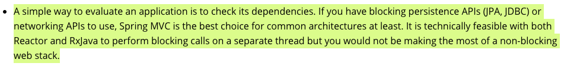

# Chapter 12. 리액티브 데이터 퍼시스턴스

## 01. 스프링 데이터의 리액티브 개념 이해하기

---

### 스프링 데이터 리액티브 개요

- 리액티브 레파지토리는 도메인 타입이나 컬렉션 대신 Mono 나 Flux 를 인자로 받거나 반환하는 메서드를 갖는다.

### 리액티브와 리액티브가 아닌 타입 간의 변환

- 블로킹 방식(JPA 레파지터리 메서드) 호출시 가능한 빨리 리액티브 타입으로 변환하여 장점 활용 가능
    - 조회: Flux.fromIteratable()로 Flux 로 변환 & 결과 처리
    - Mono 의 block()이나 Flux의 toIterable()로 객체 추출(블로킹)하여 save()(블로킹)

- 리액티브한 추출 오퍼레이션

    ```java
    Flux.fromIterable(Arrays.asList(new Customer("Jack2", "Bauer2"), new Customer("Chloe2", "O'Brian2")))
                        .subscribe(repository::save);
    ```

## 02. 리액티브 카산드라 리퍼지터리 사용하기

---

- WebFlux 프레임워크 선택은

  [https://docs.spring.io/spring-framework/docs/current/reference/html/web-reactive.html#webflux-framework-choice](https://docs.spring.io/spring-framework/docs/current/reference/html/web-reactive.html#webflux-framework-choice)




### 카산드라

- 분산처리, 고성능, 상시 가용, 궁극적 일관성을 갖는 NoSQL DB
- 데이터를 테이블에 저장된 row 로 처리하며, 각 행은 1대 다 관계의 많은 분산 노드에 걸쳐 분할된다.

  한 노드가 모든 데이터를 갖진 않지만, 특정 행은 다수의 노드에 걸쳐 복제될 수 있어 단일 장애점을 없앤다.

- 다수의 파티션에 걸쳐 분할된다.
- 카산드라 테이블은 파티션 키와 클러스터링 키를 갖는다.
- 카산드라는 읽기 오퍼레이션에 최적화되어 있다.
- Cassandra 4.0 버전부터 JDK 11 지원한다. (리액티브 스트림은 자바 9부터 지원되지만, 스프링 데이터 내부적으로 자바 8 이상부터 호환 가능하다 → Publisher API들은 리액티브 스트림 기반으로 이뤄져있다) [https://cassandra.apache.org/doc/latest/new/java11.html](https://cassandra.apache.org/doc/latest/new/java11.html)
- 현재 스프링부트 2.4.2 기준, spring-data-cassandra 의존성은 [3.1.3](https://github.com/spring-projects/spring-data-cassandra/blob/3.1.3/pom.xml)이 들어오고 있다.

  spring-data-cassandra 릴리즈 예정 최신 버전인 3.2.0-M2 에서도 3점대로 되어있다.

    ```yaml
    <cassandra.version>3.11.5</cassandra.version>
    ```

## 03. 리액티브 몽고DB 리퍼지터리 작성하기

---

### 몽고DB

- NoSQL. 스프링 데이터 몽고DB는 디폴트로 로컬로 실행되면서 27017 포트를 리스닝한다.
- 카산드라가 테이블의 행으로 데이터를 저장하는 DB, 몽고DB는 문서형 DB다.
- BSON(Binary JSON) 형식 문서로 데이터를 저장.
- MongoDB + QueryDSL

    ```java
    import static io.entangledword.persist.entity.QBlogpostMongoDoc.blogpostMongoDoc;

    import java.util.Set;
    import java.util.function.BiFunction;
    import java.util.function.BinaryOperator;

    import org.springframework.beans.factory.annotation.Autowired;
    import org.springframework.stereotype.Service;

    import com.querydsl.core.BooleanBuilder;
    import com.querydsl.core.types.Predicate;
    import com.querydsl.core.types.dsl.SetPath;
    import com.querydsl.core.types.dsl.StringPath;

    import io.entangledword.domain.post.BlogpostDTO;
    import io.entangledword.persist.entity.BlogpostMongoDoc;
    import io.entangledword.persist.repos.BlogpostRepository;
    import io.entangledword.port.out.DTOMappingService;
    import reactor.core.publisher.Flux;
    import reactor.core.publisher.Mono;

    @Service
    public class FindPostsAdapter implements FindPostsPort {

    	@Autowired
    	private BlogpostRepository repo;
    	@Autowired
    	private DTOMappingService<BlogpostDTO, BlogpostMongoDoc> mapping;

    	private static SetPath<String, StringPath> tags = blogpostMongoDoc.tags;
    	private static StringPath author = blogpostMongoDoc.author;

    	@Override
    	public Mono<BlogpostDTO> getByID(String id) {
    		return repo.findById(id).map(mapping::toDTO);
    	}

    	@Override
    	public Flux<BlogpostDTO> getAll() {
    		return repo.findAll().map(mapping::toDTO);
    	}

    	@Override
    	public Flux<BlogpostDTO> getByTagsList(Set<String> tagsValues) {
    		return findAll(tagsValues.stream().reduce(new BooleanBuilder(), (builder, value) -> {
    			return builder.and(tags.contains(value));
    		}, (t, u) -> t.and(u)));
    	}

    	@Override
    	public Flux<BlogpostDTO> getByAuthorsList(Set<String> authorsIDs) {
    		return findAll(author.in(authorsIDs));
    	}

    	protected Flux<BlogpostDTO> findAll(Predicate predicate) {
    		return repo.findAll(predicate).map(mapping::toDTO);
    	}

    }
    ```

### R2DBC(Reactive Relational Database Connectivity)

- Spring Boot 2.3(2020년 5/15)에는 R2DBC가 정식으로 지원되기 시작, 백엔드 애플리케이션과 DBMS간의 통신을 비동기로 처리하기 쉬워졌다.
- JDBC는 연결당 스레드를 사용하는데, R2DBC는 더 적은 스레드를 사용하여 더 많은 연결을 처리할 수 있으므로 잠재적으로 더 적은 메모리를 사용한다 + 스레드가 들어오는 요청을 처리하는 것과 같은 다른 작업을 더 수행할 수 있음을 의미할 수 있다

  → 스레드가 적다는 것은, CPU가 덜 필요하다는 것을 의미하는데..!

    - 퍼포먼스 비교: [https://technology.amis.nl/software-development/performance-and-tuning/performance-of-relational-database-drivers-r2dbc-vs-jdbc/](https://technology.amis.nl/software-development/performance-and-tuning/performance-of-relational-database-drivers-r2dbc-vs-jdbc/)
- R2DBC 는 2020년 10/28일에 1.2.0 버전 발표 [https://github.com/querydsl/querydsl/issues/2705](https://github.com/querydsl/querydsl/issues/2705)
- 1천만건 데이터 조회하는데 1초에(대기 시간없이) 즉각적인 응답을 확인할 수 있었다.
- 카카오헤어샵에서 [MySQL-R2DBC](https://brunch.co.kr/@purpledev/28) 조합을 열심히 연구중이다.
- **DatabaseClient**
    - 만약 서버 to 서버로 Reactive 한 요청을 한다면 R2DBC 에서는 추상화된 클라이언트를 제공한다. 아래는 간단한 사용법이다. TimeUnit.SECONDS.sleep(10) 라인을 추가한건 일반적인 메인 함수로 실행했기 때문에, 결과를 받아오기 전에 메인 쓰레드가 terminated 되는걸 기다리기 위해서이다.

    ```java
    public static void main(String[] args) throws InterruptedException {
        final PostgresqlConnectionFactory postgresqlConnectionFactory = new PostgresqlConnectionFactory(PostgresqlConnectionConfiguration.builder()
                            .host("localhost")
                            .database("test_db")
                            .username("test_user")
                            .password("1234").build());

        DatabaseClient client = DatabaseClient.create(postgresqlConnectionFactory);

        client.select()
                    .from(RNumber.class)
                    .fetch().all()
                    .subscribe(System.out::println);

        TimeUnit.SECONDS.sleep(10);
    }

    ```

###

https://www.notion.so/Chapter-12-2690fdf18cc84156b51932a95734d604
