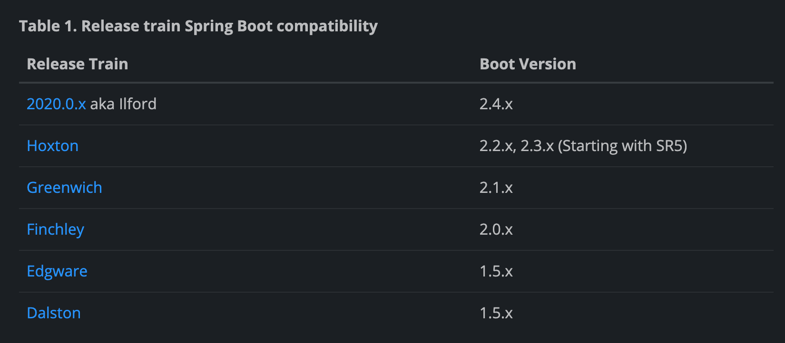

# 클라우드 구성 관리 (Managing configuration)
config 속성 공유하기


## 1. 구성 공유 ( Sharing Configuration)
`기존 구성 공유 방법`
- 구성 속성이 런타임 환경을 변경하거나, 런타임 환경에 고유한 것
    - 자바 시스템 속성 or 운영체제 환경변수를 구성속성으로 사용
    - 속성 변경 시, 어플리케이션 다시 실행되어야 함.
- 애플리케이션에 특정되고, 변경될 가능성 거의 없는 것
    - jar, war 내부에 있는 경우 어플리케이션 재배포 해야함
  
`기존 구성 공유 방법의 문제점`
- 속성 변경만을 위해 어플리케이션 재배포, 재시작 하는것 불편
- 잦은 배포 == 장애 가능성 커진다. 다수의 인스턴스인 경우, 모든 서비스 인스턴스에 동일 변경을 하는게 쉽지 않음**
- 보안에 민감한 정보들을 접근하기 위해 암/복호화 관련 정보 필요할 경우도 있음. ( 또는 특정 어플리케이션은 접근하면 안되는데 가지고 있을 수 있음.)

-> ***중앙 집중식으로 구성정보를 모으고, 어플리케이션에서 접근해 사용한다.***
  


  `중앙 집중식 구성 관리`
- 어플리케이션 코드에 구성정보를 같이 패키징 하지 않음.
- 어플리케이션 재배포, 재시작 하지 않아도 구성 정보 변경할 수 있음
- 서비스내에서 별개로 어플리케이션 관리하지 않아도 되고, 관리포인트가 1개로 합쳐짐
- 보안에 민감한 속성을 별도로 관리할 수 있음.

## 스프링 클라우드 컨피그
- 분산 시스템에서 외부 컨피그 관리를 위한 서버/클라이언트 기능을 제공함
- Config Sever를 사용하여 configuration 정보를 중앙관리함.
- client와 server가 환경/프로퍼티 동일하게 매핑될 수 있고, 다른 언어도 spring cloud config 사용할 수 있음.
- default로 git을 server storage로 사용. git에서 제공하는 버저닝 환경 역시 사용 가능. (별도 구성정보 버전관리 용)

`구성 관리 제공하는 프로젝트들(RCS - Remote Configuration Server)`
- Spring cloud config server :  
- Etcd(엣시디) : Go로 작성된 오픈소스 프로젝트, key-value로 값 관리. 초고속, 커맨드라인 위주
    - [쿠버에서 etcd를 많이 사용하나 보다](https://kubernetes.io/docs/setup/production-environment/tools/kubeadm/setup-ha-etcd-with-kubeadm/)
- Consul : 해시코프에서 만든 분산 서비스 메시
    - [콘술 소개, 콘술 vs 주키퍼](https://medium.com/giljae/hashicorp%EC%82%AC%EC%9D%98-consul-consul-template-%EC%86%8C%EA%B0%9C-cc0837533fbc)
    - [배민 프론트 서버 consul도입](https://woowabros.github.io/tools/2018/10/08/location-service-with-rcs.html)
- 그외 가능한 것들: Zookeeper Eureka, Archaius


## Spring Cloud Config Server 구성/실행
`Spring cloud server 관련 dependency`
- spring-boot: 2.4.2
- spring-cloud: 2020.0.1( Ilford )
- spring-cloud-config-server
    - 스프링 부트와 스프링 클라우드 컨피그 호환 버전 잘 확인



`bootstrap`
```java
@SpringBootApplication
@EnableConfigServer
public class ServerApplication {
  public static void main(String[] args) {
    SpringApplication.run(ServerApplication.class, args);
  }
}
```
`application.yaml`
```yaml
server:
  port: 8888

spring:
  cloud:
    config:
      server:
        git:
          uri: https://github.com/kwanguuuu/spring-cloud-config-repository
          default-label: main
```

### REST API 통한 구성속성 제공

- `{application}` : 클라이언트의  `spring.application.name` 과 매핑됨
- `{profile}` : 클라이언트의 `spring.profiles.active` (콤마로 분리)
- `{label}` : 서버 저장소 컨피그 파일의 versioning 구분(라벨 또는 브랜치 분기)
  
`구성속성 제공 방법`
- (기본) root 경로에 application.yaml 또는 application.properties에서 제공
- subpath에 구성속성 제공
- 레퍼지터리 브랜치 분기 제공


##. Spring Configure 사용 Client 추가
`Spring cloud client 관련 dependency`
- `spring-boot`: 2.4.2
- `spring-cloud-dependencies`: 2020.0.1( Ilford )
- `spring-cloud-starter-config`
  - `spring-cloud-starter-bootstrap` : [2.4.x 버전의 spring-cloud-starter-config 사용하려면 추가해줘야 빌드 성공](https://github.com/spring-projects/spring-boot/issues/24216#issuecomment-741523524)
- `spring-boot-starter-actuator` : refresh end-point위해 사용
- `spring-boot-starter-web` : 웹서버..

`bootstrap.yaml`
- application.yaml은 어플리케이션 구성정보를 읽는건데, 이 어플리케이션 구성 정보를 읽기 **이전에** spring cloud config server에서 정보를 가져와야 하니깐, bootstrap.yaml에 작성해준다. 
```yaml
spring:
  cloud:
    config:
      uri: http://localhost:8888
      label: main
      profile: dev
  application:
    name: service  #service 없으면 default로 가져온당.
```

## 구성속성 리프레시하기
- 어플리케이션을 중단 시키지 않고 구성속성을 변경할 수 있음
- 변경하고자 하는 속성이 있는 부분에 `@RefreshScope` 어노테이션 선언해 줘야함
- 수동식 변경은 `spring-actuator`의 엔드포인트 사용
- 자동식 변경은 리퍼지터리에 커밋 후크 사용하여, `spring-cloud-bus`라는 프로젝트 개입해 사용

`수동식 리프레시 하기`
  

- spring-boot-starter-actuator 추가
- actuator에서 엔드포인트 들을 제공함
    - `/actuator/refresh`: 클라이언트의 actuator endpoint로 클라우드 컨피그 서버를 호출하고, 호출한 어플리케이션의 변경 프로퍼티를 알려
    - `/actuator/bus-refresh`: 스프링 클라우드 버스 내에 있는 어플리케이션들에게 변경 프로퍼티 알려줌
    - `/monitor`: 웹훅을 통해서 변경사항이 발생할 때 마다 config 서버가 이벤트를 받을 수 있는 포인트 제공
- actuator 2.x 부터 많은 end-point가 기본 disabled가 되어있어 설정해 줘야함. (actuator 2.4.2는 health와 info만 기본 설정)
```yaml
management:
  endpoints:
    web:
      exposure:
        include: refresh
```

## 구성 속성 보안 유지하기
- 백엔드 리퍼지터리에 저장된 구성 파일에 암호화 값 쓰기
- Vault등 암호화 저장소 사용하기
    - vault: 민감 데이터 사용할 때, 안전하게 저장&제어할 수 있도록 제공하는 오픈소스
  
`git 백엔드 속성 암호화 하기`
- 암호화 키 사용하기
- 구성서버가 암호화 키 사용하도록 구성
- 클라이언트에게 암호화 데이터 제공 전에, 구성된 데이터 복호화에 사용
`bootstrap.yaml`
```yaml
encrypt:
  key: 123456  # 암호화할 비밀번호
```
- 키 생성하기
```shell
keytool -genkeypair -alias pang -keyalg RSA -keypass 123456 -keystore keystore.jks -storepass 123456
```
- 생성 키 정보 구성서버가 사용할 수 있도록 작성
```yaml
encrypt:
  key-store:
    alias: pang
    location: keystore.jks
    secret: 123456
    password: 123456
```
- 암호화 정보 `/encrypt`로 요청
```shell
curl localhost:8888/encrypt -d "1234"
```
- 암호화 된 값을 client 구성속성에 제공
```yaml
spring:
  data:
    mongodb:
      password: '{cipher}AQBFerckxSDsF+3dFtB/csB7ebKWKPRZg37QY84lFxPr/XcinaQ7U9hZBOle39EDZc0RbG6Qbie7CvgVRvTF+A8HnqTPBQ0TUd3CGgaikT/q9tSOb/IjTJNoYJPsCTgzm8DvoOAbSR+tzZiF1vKVvF60vdMhNoacyk0AjRfKpDXbyk70lM5FHhJPFqs7a9clHgf8x1PRC9k3XbrmNuO3jt/mjAc1ohmNVNTNbzg+geGmZZ1HZvZ8muI5Nlz8N+wNx/qhCeHD/IMUrQm56Z7iKlKY6oonlFyukv+ZvUinYbGUFcbxLWxSCbJh7RJgQpScewaCVkKT3+ARyO596UNxU3xaUxSq5/qzVFPdWXsoxvXRBAna3AjA0rXPl+T82dUWgjo=' 

```
# spring-cloud-config-example-
# spring-cloud-config-example-
