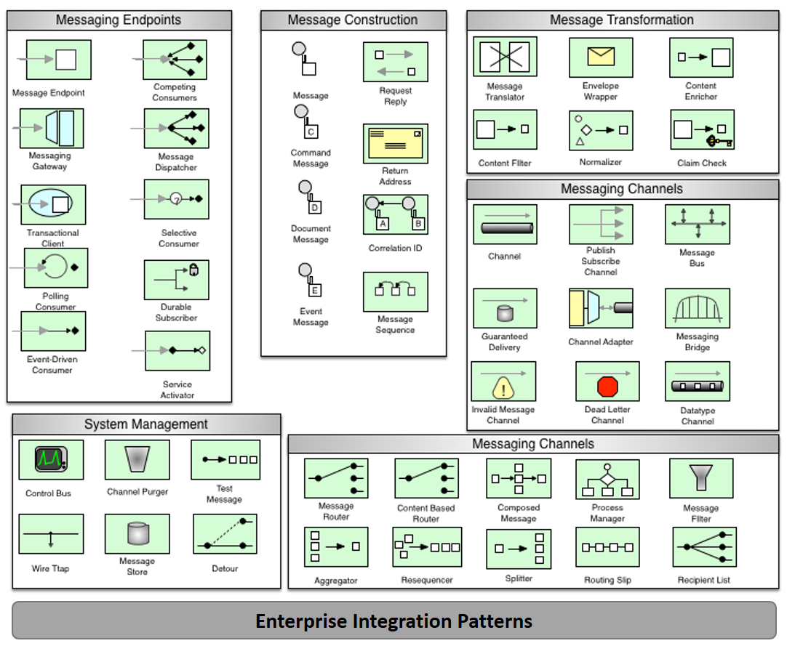
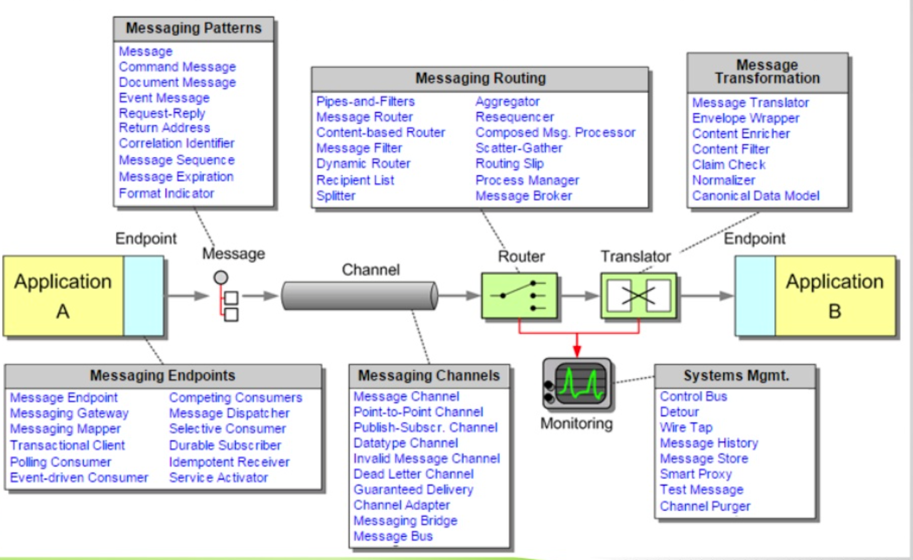

SpringIntegration 공부하면서..
- 처음 느낀점 
> Spring Integration 처음보는데 이게 뭔지 잘 모르겠음
> Spring Integration란 단어에 에 초점은 integration에 있는거고,

- 책 읽다 보니..
> integration이 뭔지, 왜 쓰는지, 왜 필요한지를 알고
> 이걸 스프링이 제공하는 기술들을 사용해서 좀더 편하게 사용할 수 있다라고 학습을 하는게 맞는 방향인 것 같음.

- 결론적으론 
자바 스프링 integration의 코드 해석과 스킬적인 부분의 학습 보단 원론/왜를 공부했다.


---
## Integration
- integration이란 용어는 엔터프라이즈적인 어플리케이션에서 더욱 자주 등장하는 것 처럼 보임.
- Integration 코드가 생기는 이유 : 합쳐서 부가가치를 만든다 라고 볼 수있음
  - 기업용 업무시스템에는 다양한 기술들이 필요하고, 기술을 필요로 하는 엔드포인트 들도 다른데, 이걸 전사적으로 통합하려고 한다면..?
  - 데이터 공유 & 서로 기능적인 부분을 제공함
  - 엔터프라이즈 어플리케이션을 작성하는 방법은 여럿이 있는데
    - job을 호출해서 데이터를 가지고 오거나, 가공하거나 하는 방식이나, 서비스 지향 아키텍쳐(SOA, Service Orientate Architecture)를 포괄함 지향함
    - 업무상의 일 처리에 해당하는 소프트웨어 기능을 서비스로 판단하여 그 서비스를 네트워크상에 연동하여 시스템 전체를 구축해 나가는 방법론이다.
    - 대부분 네가지 접근법 중 하나를 사용하는데
      - File-based integration : 파일 읽기/쓰기 등으로 단순 운용 
      - Shared-database integration : 데이터 일관성&항상성 제공하지만, 외부에서 호출해서 변경하는것으로 인한 이펙트 등을 막지 못한다
      - Remote Procedure Calls : 원격지 호출을 통해, 직렬화된 데이터를 받아서 사용
      - Message-based integration ✨ :  캡슐화된 데이터를 컴포넌트들 끼리 연결된 채널로 주고받아 사용함. 공유하기 쉽고, 빠르고, 비동기적으로도 사용가능해서 가장 많이 사용되는
    - (의견)요즘 트렌드와는 잘 어울리지 않는 기술적 방법이어서, 아마 우리가 잘 모르고 어색한 게 아닐까 싶기도 함 ( 그렇다고 요즘걸 잘 알진 않음 )
    
## Enterprise Integration Pattern 
- Integration 을 위한 어플리케이션 개발패턴
- 그래서 이런 EIP 을 설계하기 위한 다이어그램들도 존재한다.. (라떼는 설계 매우 중요)
- 
- 


## intergration pattern으로 개발되어 제공되는 것들..?
- 오픈소스 : *Mule ESB*, *Spring Integration*, Jboss Fuse, Open ESB, WSo2, Talend ESB
- ESB에 메세지브로커로 많이 사용하는것들 : ActiveMQ, Apache Kafka, RabbitMq
- EAI, SOA 패턴으로 개발된 것들 : IBM WebSphereMQ, TIBCO, VITRIA, Oracle ServiceBus, WebMethods, Microsoft BizTalk, Fiorano 


## Spring Integration 개략적으로(소개글)
- 스프링베이스의 가벼운 메세징관련 어플리케이션 개발 가능
- 어댑터 설정을 통해서, 외부 시스템과 통합 가능함
- 리모트 호출, 메세징, 스케쥴링 등 추상화가 잘 되어 있어 사용이 편리.
- *결론적으로 뭐.. 쓰기 쉬운 어플리케이션이란 말*

## Spring integration의 goal, principles ( 철학..)
- goal
  1. 복잡한 엔터프라이즈 통합 솔루션의 쉬운 구현을 제공함
  2. 스프링베이스 어플리케이션으로, 비동기, 메세지 드라이븐을 용이하게 함
  3. 스프링 사용하는 유저들에게 직관적으로 제공한다
- 원칙
  1. 컴포넌트들은 약한 의존성을 갖고, 모듈 자체로 테스트 하기 용이하게 한다
  2. 비즈니스 로직과 통합로직 간의 분리하기 쉽도록 한다
  3. 재사용 하고, 분리하기 쉽도록 추상성을 제공함 (하지만 경계가 명확하도록 제공되야 한다)

## Spring Integration Code Convention
- *int*:  xml 정의 할 때, spring-integration namespace 컨벤션이라고 보면 됨.
  - int, inf-file,int-webflux, int-steram 등등..
 ```xml
<?xml version="1.0" encoding="UTF-8"?>
<beans xmlns="http://www.springframework.org/schema/beans"
  xmlns:xsi="http://www.w3.org/2001/XMLSchema-instance"
  xmlns:int="http://www.springframework.org/schema/integration"
  xmlns:int-webflux="http://www.springframework.org/schema/integration/webflux"
  xmlns:int-stream="http://www.springframework.org/schema/integration/stream"
  xsi:schemaLocation="
  http://www.springframework.org/schema/beans
  https://www.springframework.org/schema/beans/spring-beans.xsd
  http://www.springframework.org/schema/integration
  https://www.springframework.org/schema/integration/spring-integration.xsd
  http://www.springframework.org/schema/integration/webflux
  https://www.springframework.org/schema/integration/webflux/spring-integrationwebflux.xsd
  http://www.springframework.org/schema/integration/stream
  https://www.springframework.org/schema/integration/stream/spring-integrationstream.xsd">
</beans>
```
## Spring Integration 5.4 바뀐부분
1. 신규 컴포넌트들 추가 
  - apache kafka channelAdapter, r2dbc channel adapters, redis Stream support, renewable lock registry, zeroMq support
2. one-way 게이트웨이의 리턴타입 변경
  - ( void -> nullChannel) = 리턴타입에 채널이 없다는걸 nullChannel 처럼 명시해줘야함.
3. TCP/UDP 변경
  - TcpSender로 multiple sending 지원.  (   <artifactId>spring-integration-ip</artifactId> 의존성 추가)
4. RMI 변경
  - spring-integration-rmi 모듈 deprecated (다음 메이저 버전 배포시 삭제될 것임)
5. AMQP 인터페이스 변경
6. Mail adapter 변

## Spring Integration Core 이해해야 하는 것들
- Messages
- Message Channel
  - Channels (파이프)
- End Points 
  - 필터, 변환기, 라우터, 분배기,집적기, 서비스액티베이터, 채널어댑터, 게이트웨이

### Message
- 어떤 스프링프레임워크에서 데이터 처리될 수 있도록 *메타데이터(헤더)*와 *자바객체(페이로드)*를 래핑한 것이라고 보면 됨  
1. 헤더
  - 공통적인 정보들을 가짐 (ex. id, timestamp, 주소 )
2. 페이로드
  - 어떤 타입도 가능
  
### Message Channel
- 파이프라고 보 된다.
- producer가 메세지를 채널로 보내고, 컨슈머는 채널로부터 메세지를 받는다.
- 디커플링 형태로 구성되고, 메세지 모니터링 하기 쉽도록 구성되어 있다.
- 일대일(point to point) 또는 일대다(publish- subscribe) 로 구성되어 있음.
- 폴러블 채널(폴링 채널)들은 대기열 설정 가능 
- 목적에 맞는 다양한 채널 구현방법들
  - PublishSubscribeChannel, QueueChannel, PriorityChannel, RendezvousChannel, DirectChannel, ExecutorChannel, FluxMessageChannel
  - 위의 채널들을 폴러블 여부/ 스레드 / 목적에 따라서 한번씩 보자

### Message EndPoint
- 파이프라인에서 필터의 역할을 한다고 보면 된다. (여기서 필터는 필터 컴포넌트랑 다르다)
- 어플리케이션 코드(모듈&기능)를 메세징 프레임워크에 연결하는 역할
- 어플리케이션 코드는 메세지 채널들에 대해 알 수 없음 (그냥 인풋 아웃풋만. MVC랑 비슷)
  - mvc controller는 http 요청을 다루고, message-endpoint는 메세지를 다룸
  - mvc 컨트롤러는 url 패턴에 매핑되고, endpoint는 channel에 매핑된다.
  - 종류: Transformer, Filter, Router, Splitter, Aggregator, ServiceActivator,  Channel Adapter, 

## Configuration
- `@EnableIntegration`: 4.0 버전 이후부터,지원된 어노테이션. 스프링 인테그레이션 빈 사용을 가능케 함.
- `@IntegrationComponentScan`: `@ConponentScan`과 비슷. 근데 스프링 인테그레이션 컴포넌트들만 스캔한다. (일반적 스프링 컴포넌트들은 스캐닝 안)
  - `@MessagingGateway`

## SpringIntegration 프로그래밍 팁
- xml 컨피그는 되도록 하지 말고 지양.( 공식 가이드 문서에서, ide에 플러그인 설치해서 도움 받거나 하라고 말함.) (하위버전 에러 존재하는듯)
- 자바 컨피그 , DSL
 - 스프링 인테그레이션의 일급 객체(first-class citizens)가 누구인지 이해하면 편함
   - 일급객체: Message, MessageChannel, AbstractEndPoint
   - 각각 Message, MessageChannel, AbstractEndpoint으로 구현
  - Message와 MessageChannel은 그냥 구현되는거 보면 편함
  - AbstractEndPoint는 이해가 좀 필요
    - 얘는 EventDrivenConsumer와 PolingCnsumer 로 구현되고 (각각 SubscribableChannel, PollableChannel) -> 이걸로 구독 패턴이랑, 폴링 패턴 생성.


## (개인적인 생각)  왜 잘 쓰는것 같지 않고 인테그레이션이란 개념이 어색할까.? (마무리...)
- 대체품이 많다. (메세지 큐에서 생각이 났음) 
  - 인테그레이션에서 필요로 하는 핵심 기술인 메세지/채널/엔드포인트 개념을 다른 더 작은 모듈에서도 비슷하게 개발할 수 있지 않음? (ex 래빗,카프카)
- 엔드포인트 모듈들이 너무 많은데, 1~2개만 사용하자고 선택하기도 쉽지 않을것 같고, 여럿을 모두 쓰자니 이해하고싶은 러닝커브가 클것 같다
- java 의존적...이잖아
- MSA 프레임워크가 대두 된 이유가 여렀이 있겠지만, 잦은 배포/ 사용자 요구사항의 잦은 변화를 대응하는 것도 있는데, 스프링 인테그레이션은 그 트렌드에 부응할 수 있을까?
- 음 그래도 장점은
  - 스프링, 자바다..
  - 스탠드 얼론 어플리케이션 가능하니깐..?
  - 계속 업데이트 하는중..(메인테이너는 아직 죽지 않음)
- 기능적 이점을 찾아 비교하는것도 왜라는 이유를 찾는데 도움이 되지 않을까.

## Spring cloud stream

참고
- [spring-integration-pdf_reference](https://docs.spring.io/spring-integration/docs/current/reference/pdf/spring-integration-reference.pdf)
- [enterprise-integration-patterns-with-spring-integration](https://www.slideshare.net/hegdekiranr/enterprise-integration-patterns-with-spring-integration)
